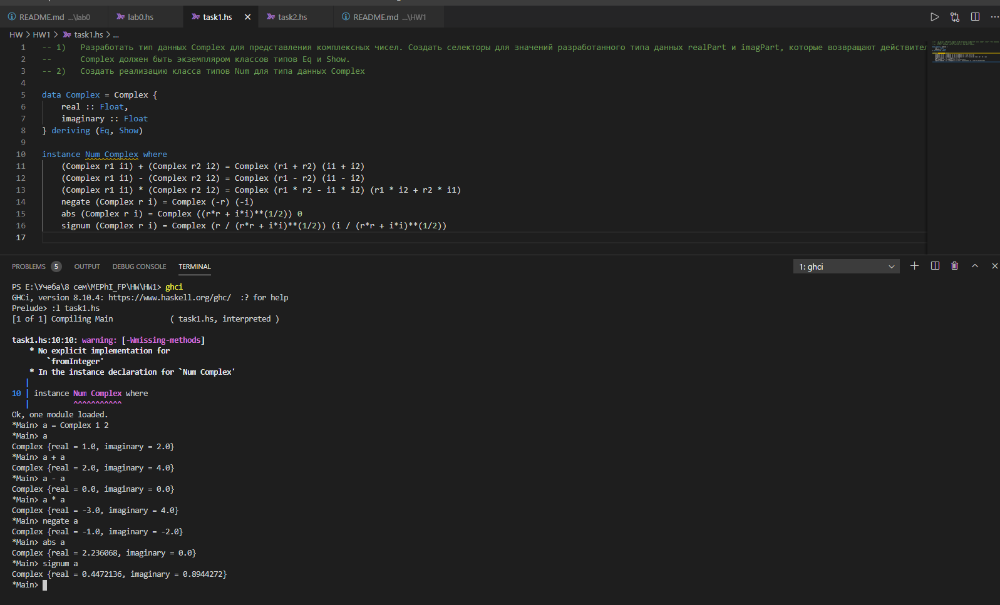

# HW1. Пользовательские типы данных. Экземпляры классов типов.
### task1
1)	Разработать тип данных Complex для представления комплексных чисел. Создать селекторы для значений разработанного типа данных realPart и imagPart, которые возвращают действительную и мнимую части комплексного числа соответственно.  
Complex должен быть экземпляром классов типов Eq и Show.  
2)	Создать реализацию класса типов Num для типа данных Complex.  
  
### task2
Определить экземпляры классов типов Functor и Applicative для типа данных Fun.  
