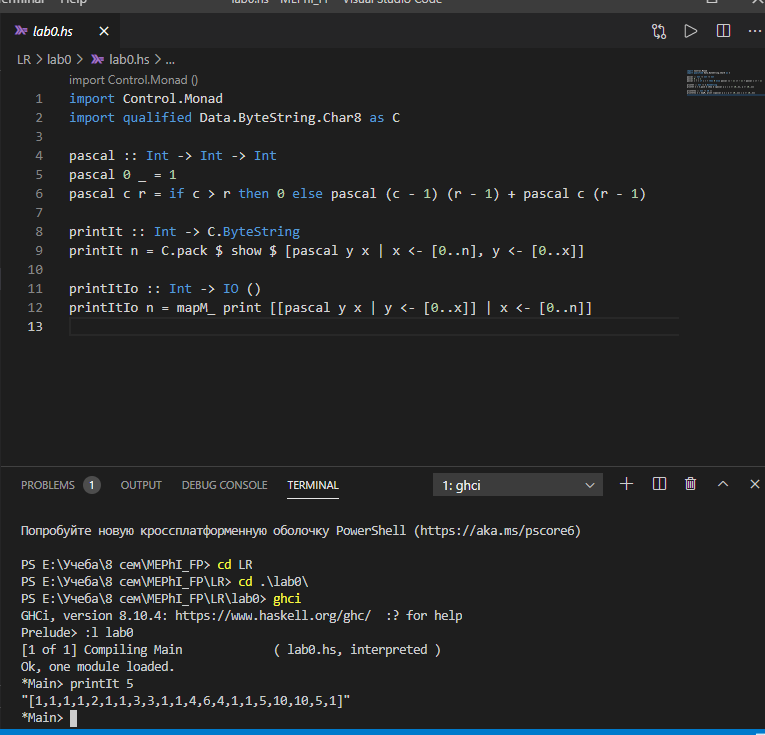
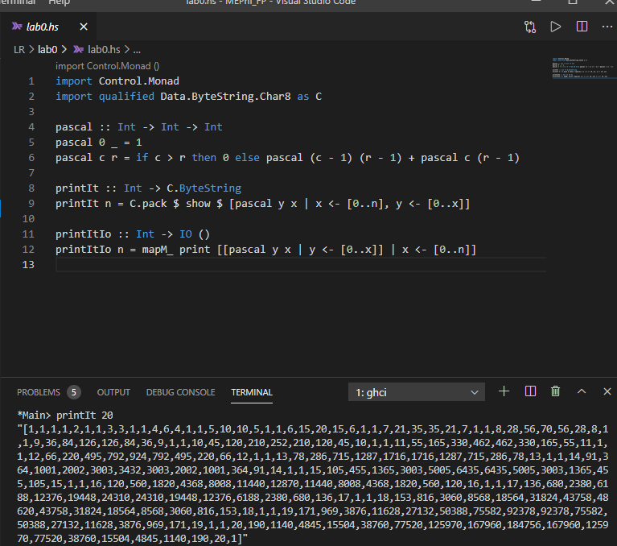

# Лабораторная работа 0. Треугольник Паскаля
### Задание 1: 
Реализовать функцию pascal c r в файле __lab0.hs__. Здесь c – это номер столбца, а r – номер строки. Столбцы и строки отсчитываются начиная с нуля.  
### Задание 2: 
Вычислить значения:  
1)	printIt 5  
  
2)	printIt 20  
  
3)	printIt 100 (попробовать printItIo 100, медитировать,…,медитировать)